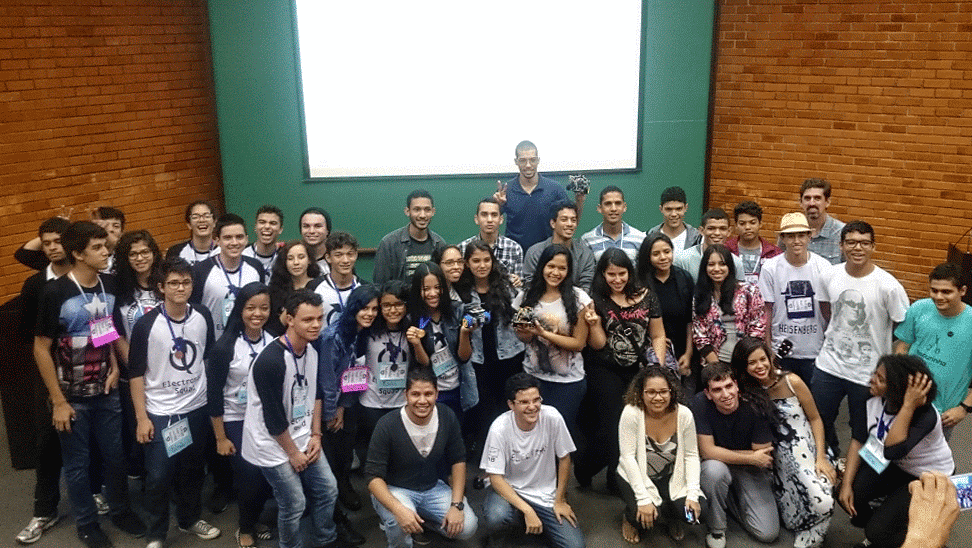
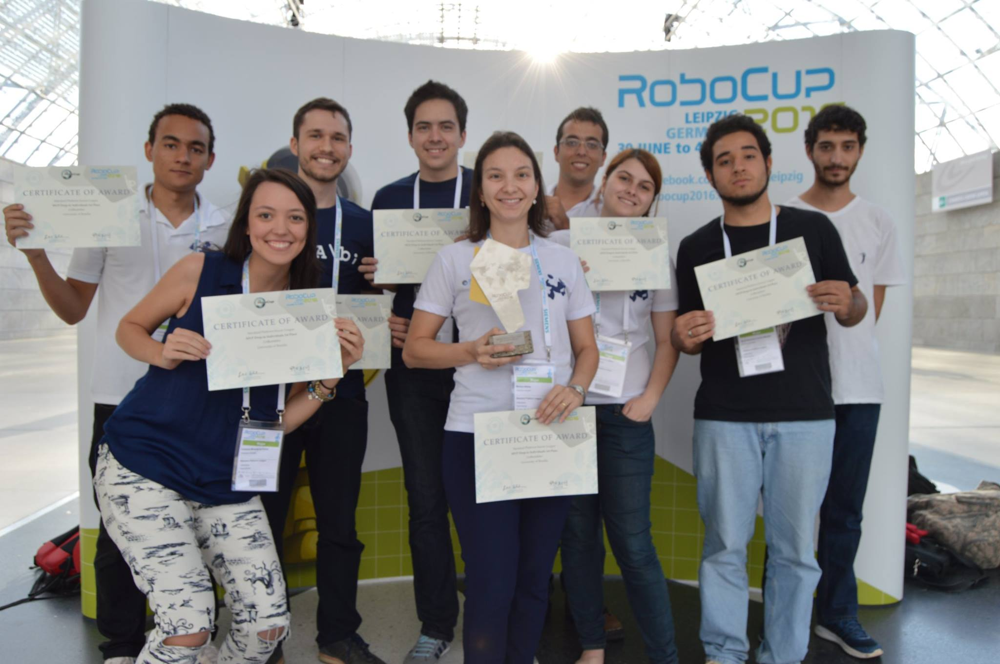
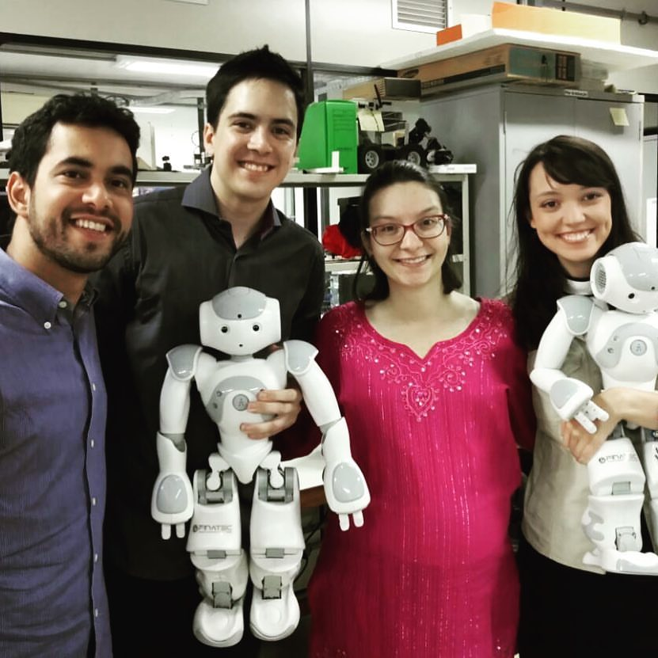

My name is Yuri Rocha and I am a Brazilian who's currently living in South Korea. I have a B.Sc. in Control and Automation Engineering from the University of Brasilia (UnB). I am currently pursuing a Master's degree in Electrical and Computer Engineering at Sungkyunkwan University (SKKU).

---
### My History

My academic life started when I entered the University of Brasilia (2011). During my undergraduate studies, I had a keen interest in learning as much as possible from different areas, but foremost, to share the knowledge and the experience that I have been given. I was part of the “Electron Project” (2013-2014, 2015-2016), which was created by the IEEE UnB Student Branch. As a voluntary of this project, I gave practical lessons about Electronics for high school students, in order to encourage them to ingress into Engineering courses at Federal Universities.

*Electron Project - 2016*

In the third year of my graduation, I was eager to engage in more practical activities, on which I could apply concepts learned on theory and see how they translate to the physical world. Hence, I joined the UnBeatables Robot Soccer Team (2014), wherein I developed the robot behavior and computer vision regarding a soccer match. On that same year, we won the first place in the RoboCup SPL Drop-In Only league.

In 2014, I received an exchange student scholarship from the Science Without Borders Program, which led me to study for one year in South Korea, at Sungkyunkwan University. There I was able to study subjects from the Computer Engineering major in such way to compliment my studies in Brazil, enlarging my perspective of my field of study. I also completed two internships in the Advanced Institutes of Convergence Technology (Winter, 2015) and in the Hyundai Motor Company (Summer, 2015), which further enriched my experience in Korea.

After coming back to Brazil, in 2015, I rejoined the UnBeatables team as the development leader. In the same year and in 2016 we received several awards from different competitions: first place on the Latin American Robot Soccer Competition (2015, 2016) and first place on the RoboCup SPL Drop-In MVP Individuals (2016).

*Robocup Leipzig - 2016*

As a way to provide to children in need a chance to interact with real robots, we created the UnBeatables outreach project, where we performed ludic presentations in public schools and children hospitals.

    

        <iframe src="https://drive.google.com/file/d/1XBAO57M1xRluizfFkuugE6afXKtCOigx/preview" 
        frameborder="0" 
        allow="accelerometer; encrypted-media; gyroscope; picture-in-picture"
        allowfullscreen></iframe>
    

<em>UnBeatables Outreach Project</em>

By the end of 2016, I was granted the title of Bachelor’s degree due to the conclusion of the Mechatronics Undergraduate Program with major on Control and Automation. Our dissertation was about controlling two arms of a humanoid robot using the cooperative dual task-space. Using the description of the cooperative dual task-space using unit dual quaternions, our goal was to implement on a simulated system and, later on, on a physical platform different task controllers aiming the execution of a common activity regarding house service: carrying and positioning a tray using both arms.

*Photo after presenting our Bachelor Dissertation*

From August 2016 to July 2017, I worked as a software developer at the company Moringa Digital. There I was able to apply all my knowledge about programming and project management, while also learning several new technologies.

In August 2017 I was selected by the Korean Government Scholarship Program (KGSP) which gave me the opportunity to continue my research as a Master's degree student at Sungkyunkwan University. Before starting my Master's Degree, I studied Korean Language at Konyang University for 1 year. In September 2018, I started my Master's course in Electrical and Computer Engineering at SKKU.

I am currently a member of the Control and Robotics Lab and my research is about Semantic Simultaneous Localization and Mapping (Semantic SLAM) on highly dynamic environments.